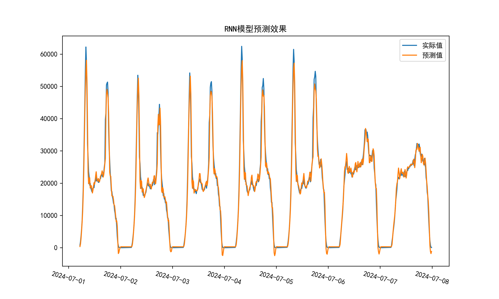

# 🚆 城轨线网客运量预测（RNN模型）

本项目基于PyTorch实现了一个循环神经网络（RNN），用于预测城轨线网15分钟粒度的客运量数据。

## 📂 项目结构

```
.
├── rnn.py               # 主程序，包含数据读取、模型训练与预测
├── rnn_model.pth        # 保存的模型参数文件
├── RNN.png              # 模型预测结果可视化图
└── README.md            # 项目说明文档
```

## 🛠️ 环境配置

- Python 3.x
- PyTorch
- SQLAlchemy
- psycopg2
- pandas
- numpy
- matplotlib
- scikit-learn

## 🔧 使用方法

1. 配置数据库连接：

修改`rnn.py`中的数据库配置（db_config），确保可访问你的本地PostgreSQL数据库。

2. 运行代码：

```bash
python rnn.py
```

> 若首次运行，模型会进行训练并保存参数到 `rnn_model.pth`。  
> 后续运行则直接加载模型进行预测。

## 📅 数据说明

- **训练数据**：2023-04-01 至 2024-07-01
- **测试数据**：2024-07-01 至 2024-08-01

## 📈 输出结果

- 预测结果图保存为：`RNN.png`
- 模型性能评价指标（MSE, MAE, MAPE, R²）将在终端显示。


## 🚀 后续计划

- 优化模型超参数，提升预测精度
- 实现自动化数据更新与模型定时训练
